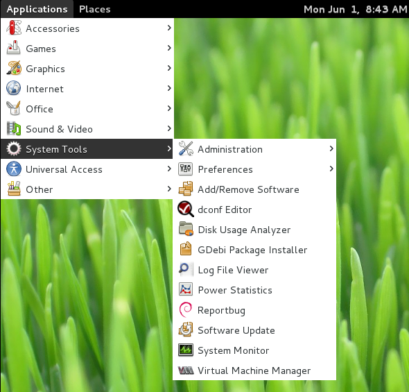
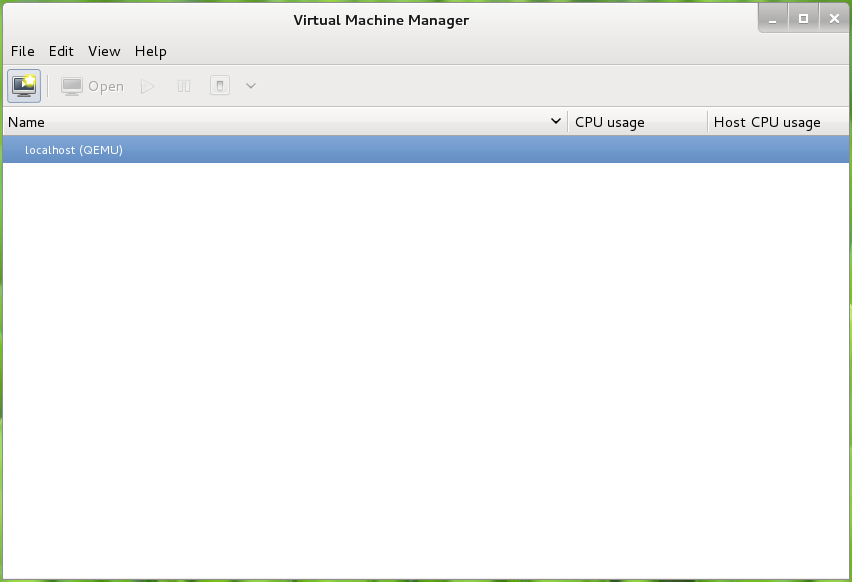

# ENTORNO DE VIRTUALIZACION 
## Pasos previos
Para contar con los permisos suficientes para instalar se recomienda usar el programa **sudo** para brindar los privilegios a usuarios del sistema.
```
~$ su
~$ apt-get install sudo
```
Asignar al usuario definido los permisos para el  **grupo sudo**
```
~$ su
~$ adduser remmy-pc sudo
```


## Instalacion del virtualizador KVM y su administrador
Ingresar los siguientes comandos:
```
~$ sudo apt-get -y install qemu-kvm libvirt-bin virtinst virt-viewer
```
Instalacion del adminstrador de maquinas virtuales
```
~$ apt-get install virt-manager
```
Adicionar usuario al grupo **kvm** y **libvirt** para administrar la plataforma de virtualizacion:
```
~$ adduser remmy-pc kvm
~$ adduser remmy-pc libvirt
```
Aplicar cambios (reiniciar la sesión).

## Administración del entorno de Virtualizacion

Cuando la instalacion se ha completado, ejecutar el administrador con: `Applications>System Tools>Virtual Machine Manager`




