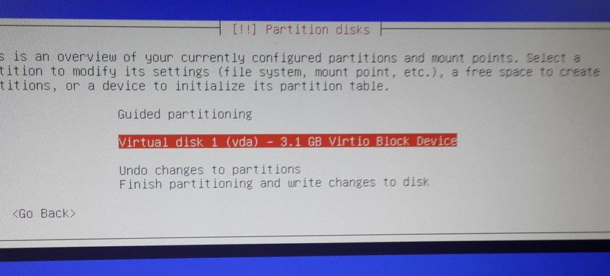
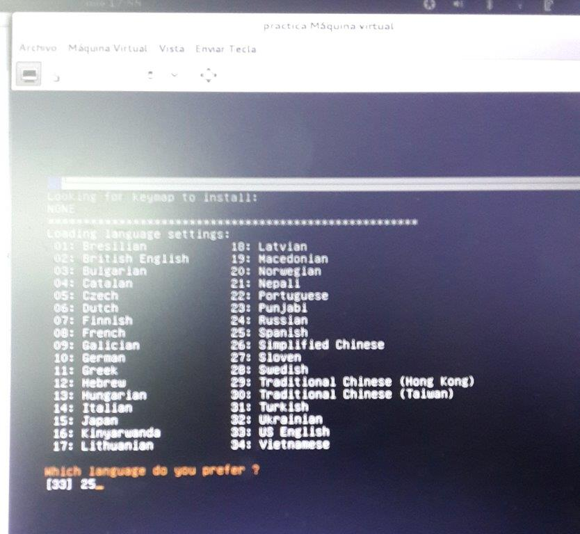

# MAQUINA VIRTUAL 
## Creacion de una maquina virtual
* el proposito de crear una maquina virtual sobre la base de una infrestructura de hardware es simular un equipo de carcteristicas casi similares o aproximadas :

1. En el Administrador de la maquina virtual "Virtual MAchine Manager" seleccionar la opcion nueva maquina virtual ya signar un nombre. Seguidamente un asistente guiara los pasos de instalación. 

2. Seleccionar medio de instalacion: Utilizar imagen ISO. 

3. Seleccionar tipo de instalacion y version del sistema operativo: Linux - Debian Wheezy. 

4. Elegir la Confoguraciob de la memoria del CPU: 1056Mb y 1 CPU 

2. Crear y Seleccionar volumen de almacenamiento: Para el eqjemplo creamos un LVM de 2.93GB en formato qcow2. 

3. Habilitar espacio de almacenamiento para la maquina viertual: Para el ejemplo elejimos administrado y seleccionamos el LVM creado. 

2. Listo para iniciar la instalacion de la Maquina Virtual. 

2. Inicia la instalacion de Debian (modo normal). 

2. Inicia la instalacion: seleccionar lenguaje. 

2. Inicia la instalacion: seleccionar territorio. 

2. Inicia la instalacion: seleccionar localizacion. 

2. Inicia la instalacion: configuracion de teclado. 

2. Inicia la instalacion: ingresar nombre del host. 

2. Inicia la instalacion: ingresar nombre de dominio. 

2. Inicia la instalacion: ingresar nombre de una cuenta de usuario. 

2. Inicia la instalacion: seleccionar tipo de instalacion manual. 

2. Inicia la instalacion: seleccionar el disco virtual 1 (vda) para el particionamiento de discos. 

2. Inicia la instalacion: creamos una tabla de partición   

2. Inicia la instalacion: crear volumen de grupo sobre el dispositivo libre. 

Finalizamos el particionado de discos y grabamos los cambios.

2. Instalacion: selecicionamos el origen de la instalacion "garted.iso". 

3. Expandir el tamaño del disco duro virtual. 

Por ultimo reiniciamos la maquina virtual.

